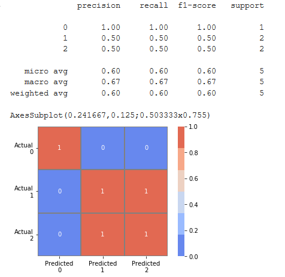

# lambdata
## ClassificationVisualization
```
pip install -i https://test.pypi.org/simple/ lambdata-crawftv
from lambdata_crawftv/ClassificationVisualization import classification_visualization
classification_visualization(y_true,y_pred)
```

